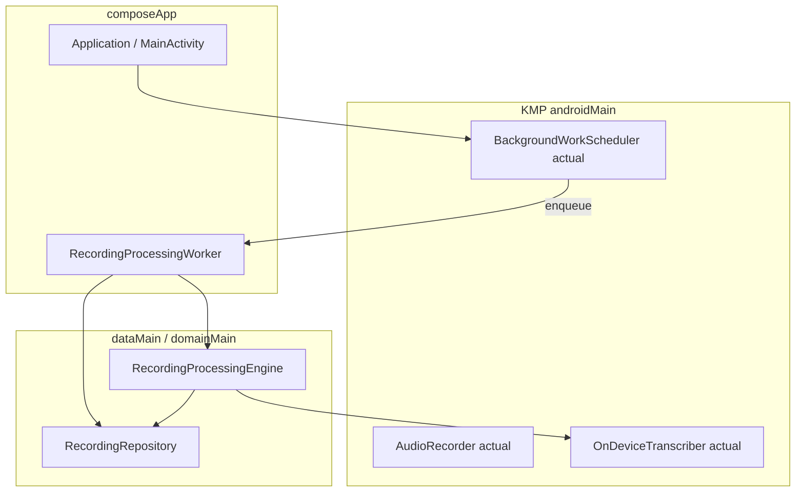

# Recording pipeline — Android implementation plan

**Parent doc:** [`recording-pipeline-detailed-plan.md`](recording-pipeline-detailed-plan.md) (architecture, product rules, class communication).

**Goal:** Implement the full recording → on-device STT → insight → WorkManager pipeline for **Android first**, with maximum logic in **KMP shared layers** (`domainMain`, `dataMain`, `commonMain`) and **Android-specific** code in `androidMain` / `composeApp`.

**Out of scope here:** iOS `actual`s, `BGProcessingTask`, Xcode config — see [`recording-pipeline-ios-plan.md`](recording-pipeline-ios-plan.md).

---

## 0. Strategy: what lands where

| Layer | Module / source set | Android plan owns |
|-------|---------------------|-------------------|
| Domain types, use cases, ports | `feature_dump` / `domainMain` | Yes — implement fully |
| SQLDelight schema & JVM tests | `core_database` | Yes |
| Repository + engine + HTTP insight | `feature_dump` / `dataMain` | Yes |
| `expect` / `actual` for STT, WM scheduler | `commonMain` + `androidMain` | **Android `actual` only** in this phase |
| WorkManager `Worker` | `composeApp` or `feature_dump` `androidMain` | Yes |
| UI (Compose) | `feature_dump` / `presentationMain` + `composeApp` | Yes (shared UI; test on Android) |
| iOS `actual`s | `iosMain` | Stub/no-op or unchanged until iOS plan |

**Rule:** Any interface the engine needs from the OS must have an **`expect` in common** and a **real `actual` on Android**; iOS can ship a **temporary stub** that throws or no-ops so the project still compiles for iOS until the iOS plan runs.

---

## 1. Android-specific architecture snapshot



---

## 2. Prerequisites from parent plan (do on Android track)

Complete these **shared** phases on the Android branch first (they are not Android-only, but block everything):

| Parent phase | Notes for Android |
|--------------|-------------------|
| **A** — domain enums, `error_code`, WM allowlist | JVM unit tests in `commonTest` / `domainTest` |
| **B** — SQLDelight | Run `./gradlew :core_database:generateSqlDelightInterface`; driver tests on **Android instrumented** or JVM if you add sqlite driver |
| **C** — repository | Same |
| **E** — insight HTTP | Ktor already Android-capable via `androidMain` engine in `core_network` |
| **F** — `RecordingProcessingEngine` | Pure Kotlin; test with fakes |

---

## 3. Android phases (ordered, small tasks)

### Phase AD — Android on-device transcription

| ID | Task | Deliverable | Tests |
|----|------|-------------|-------|
| AD1 | Add `expect class` or interface `OnDeviceTranscriber` in **common**; **actual** in `feature_dump/androidMain` | Kotlin files | Common fake unit test |
| AD2 | **Permissions:** ensure `RECORD_AUDIO` + runtime request path before record; document if `POST_NOTIFICATIONS` needed for WM UX | `AndroidManifest` + VM/screen | Manual |
| AD3 | Implement STT using **SpeechRecognizer** (or chosen API): **en-US**, **hi-IN** locale tags | `AndroidOnDeviceTranscriber` | Instrumented: return text on emulator with Google app / network where required |
| AD4 | Detect **unsupported** / error callbacks → map to `ON_DEVICE_LANGUAGE_NOT_SUPPORTED` or `TRANSCRIPTION_FAILED` | Mapper in actual | Unit: synthetic error codes |
| AD5 | **10 min cap:** validate `duration_ms` in `MediaRecorder` / metadata before save; reject over cap with user-visible message | Recorder + use case | Unit |
| AD6 | **File path / URI:** contract with engine (path string vs `content://`); ensure file readable from worker thread (`Dispatchers.IO`) | Doc in class KDoc | Instrumented read after stop |

### Phase AG — WorkManager

| ID | Task | Deliverable | Tests |
|----|------|-------------|-------|
| AG1 | Add dependency `androidx.work:work-runtime-ktx` (version aligned with project) | `composeApp/build.gradle.kts` or feature module | Gradle sync |
| AG2 | `RecordingProcessingWorker` extends `CoroutineWorker`; inject `RecordingProcessingEngine`, `RecordingRepository` via **Koin** `WorkerFactory` or `EntryPoint` | `composeApp` | Robolectric / `TestListenableWorkerBuilder`: assert **one** `process(id)` per id per run |
| AG3 | **Unique work** name: `recording_process_{id}`; `ExistingWorkPolicy.KEEP`; constraints: `NetworkType.CONNECTED` for insight step (or split worker: STT offline if ever possible — v1 likely network for insight only) | Worker registration | Unit: request tags |
| AG4 | **Eligibility query** in repository: `PENDING` ∪ `FAILED` with transient `error_code` ∩ `background_wm_attempts == 0` | SQL + mapper | SQLDelight / integration test |
| AG5 | Worker loop: for each id → **increment** `background_wm_attempts` **before** `process` (or immediately after dequeue — pick one and document) → `process` → exit; **no inner retry loop** | Worker | Test: two ids → two process calls |
| AG6 | `BackgroundWorkSchedulerAndroid`: `enqueueAfterSave(recordingId)`, `schedulePeriodicMaintenance()` (e.g. daily unique work) | `androidMain` | Manual: log WorkManager queue |
| AG7 | Call scheduler from **`Application.onCreate`** or **MainActivity** (once): register periodic + enqueue flush | `composeApp` | Manual cold start |

**Insight requires network:** Engine should fail insight with `NETWORK` if offline; WM constraints ensure retry when connected. STT may run offline depending on device — engine order is still transcribe → insight.

### Phase AI — Android presentation & DI

| ID | Task | Deliverable | Tests |
|----|------|-------------|-------|
| AI1 | Koin: bind `OnDeviceTranscriber`, `BackgroundWorkScheduler` **actual**, `RecordingProcessingEngine`, register `WorkerFactory` | Module split | Startup smoke test |
| AI2 | `DumpViewModel`: save → insert → `engine.scheduleImmediate` + `scheduler.enqueueAfterSave` | VM | `runTest` + Turbine |
| AI3 | Compose: processing section, FAILED + Retry, Hindi block copy | Screens | Compose UI test (optional) |
| AI4 | **ProGuard / R8:** keep rules for `Worker`, Koin workers if minified | `proguard-rules.pro` | Release build |

### Phase AJ — Android QA matrix

| ID | Task | Deliverable |
|----|------|-------------|
| AJ1 | Device matrix: Pixel + one low-end OEM; **en** / **hi**; airplane mode; Doze overnight |
| AJ2 | Kill app during `TRANSCRIBING`; relaunch → resume from checkpoint (transcript skip) |
| AJ3 | WM: verify **only one** background attempt per recording until manual Retry |

---

## 4. Suggested file locations (adjust to your tree)

| Piece | Likely location |
|-------|-----------------|
| `OnDeviceTranscriber` expect | `feature_dump/src/commonMain/.../platform/` or `domain/...` |
| `OnDeviceTranscriber` actual | `feature_dump/src/androidMain/.../platform/` |
| `BackgroundWorkScheduler` expect | `commonMain` |
| `BackgroundWorkScheduler` actual | `feature_dump/androidMain` or `composeApp` |
| `RecordingProcessingWorker` | `composeApp/src/androidMain/.../` (needs `AndroidManifest` `provider` for `WorkManagerInitializer` if custom) |
| Koin `WorkerFactory` | `composeApp/.../di/` |

---

## 5. Dependency order (Android-only view)

```
Parent A,B,C,E,F (shared) ──► AD* (STT actual) ──► F wire with real STT
         └──► AG* (WM) in parallel after F stable
         └──► AI* (DI + UI)
         └──► AJ* (QA)
```

---

## 6. Handoff to iOS plan

When Android is **done**, the iOS plan will:

- Implement **`OnDeviceTranscriber` actual** with `SFSpeechRecognizer`.
- Implement **`BackgroundWorkScheduler` actual** (foreground minimum + optional BG task).
- Reuse **unchanged** domain, DB, engine, repository contracts.

---

## 7. Revision log

| Date | Note |
|------|------|
| 2026-04-03 | Initial Android-first platform plan |
