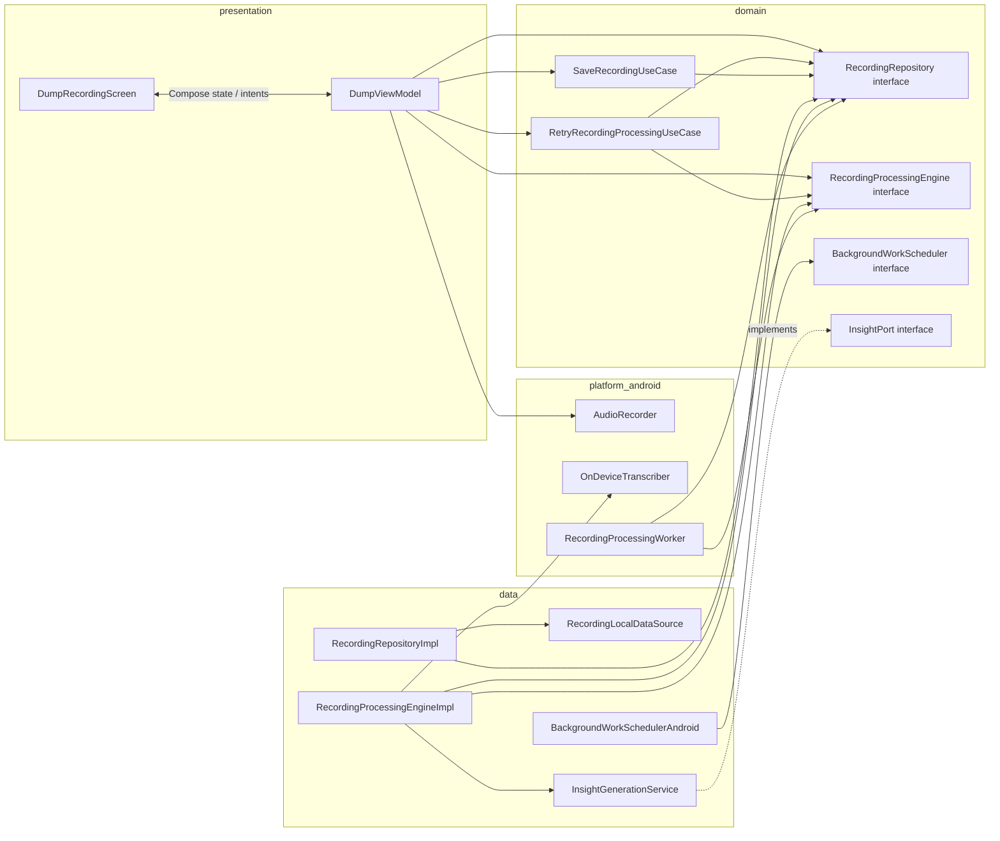
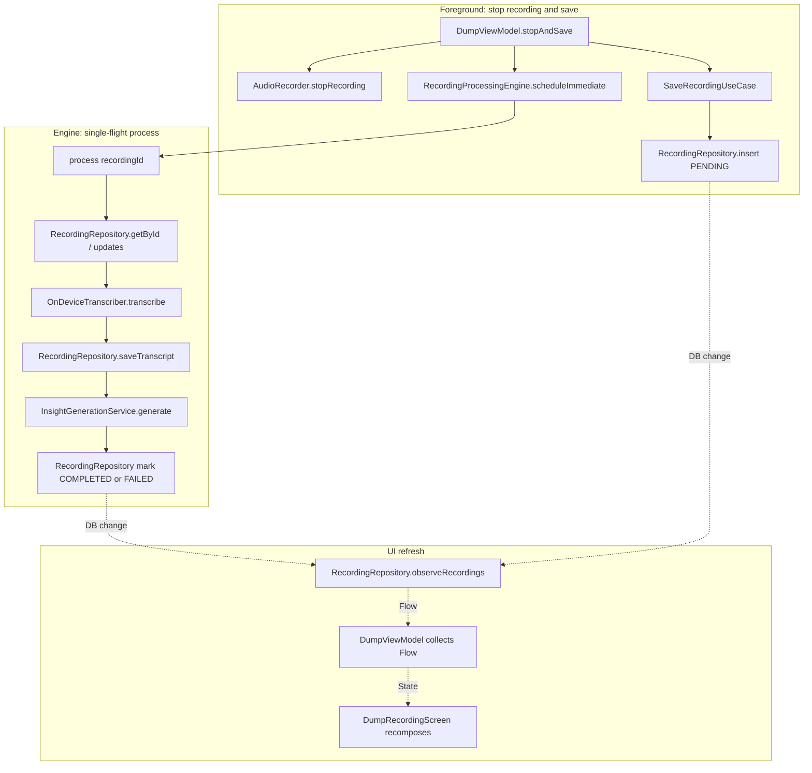
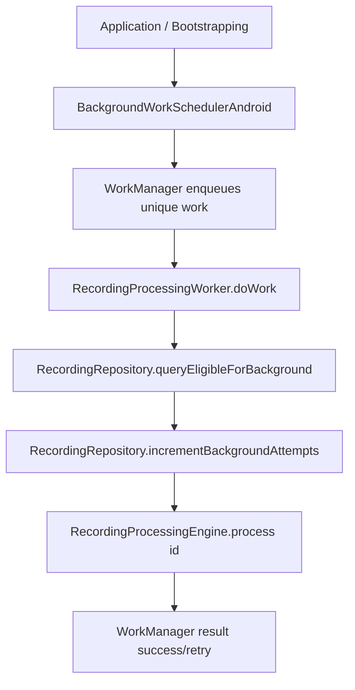
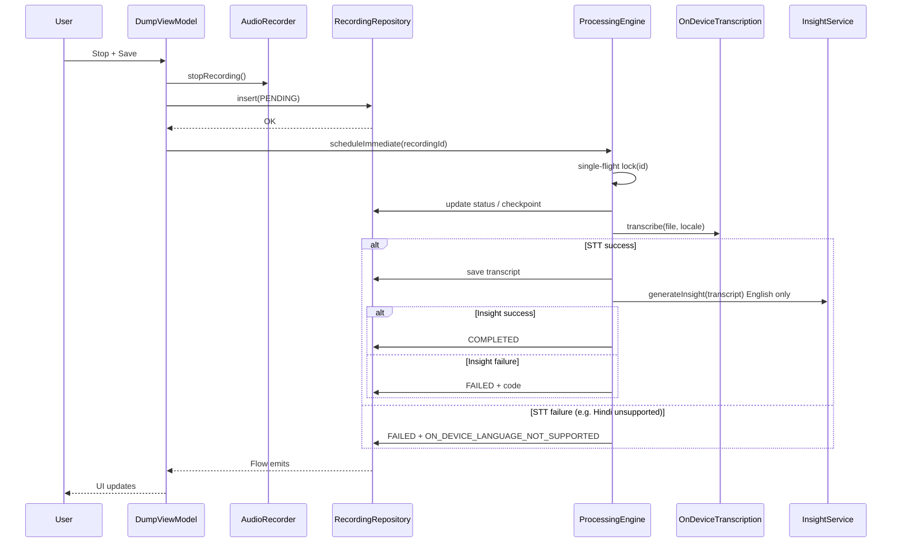
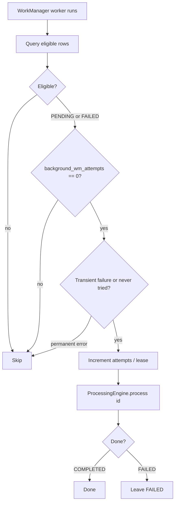

# Recording & background processing — detailed implementation plan (v2)

**Platform execution order:** implement [**Android plan**](recording-pipeline-android-plan.md) first, then [**iOS plan**](recording-pipeline-ios-plan.md). This document remains the **shared** architecture and product source of truth.

This document supersedes **discussion** from product Q&A; it does **not** modify `async-background-processing-plan.md`.

**Product rules (locked):**

| Rule | Decision |
|------|----------|
| Eligibility | Only **saved** recordings (**row in DB**). No save → no file in pipeline / delete temp. |
| First attempt | **No** invisible auto-retry in the foreground flow; on failure → **FAILED** + message + **Retry**. |
| WorkManager (Android) | May pick **PENDING** and **FAILED** (subject to **transient vs permanent** and caps). |
| WM cap | **One** WM-driven attempt per recording per “cycle”; **manual Retry** resets WM eligibility counter. |
| Insights | **English only** (transcript may be Hindi; prompt forces English output). |
| Hindi / on-device | If on-device Hindi **unavailable** → **block** with actionable message (no silent cloud STT in v1). |
| Recording length | **10 minutes** max (enforce in UI + recorder + pipeline). |
| iOS | **expect/actual** background scheduler analogous to WM (minimum: process on next foreground if BG not ready). |

---

## 1. Architecture (detailed flow)

### 1.1 Layering

```
┌─────────────────────────────────────────────────────────────────┐
│ presentation: screens, ViewModel — observes DB / use cases      │
└───────────────────────────────┬─────────────────────────────────┘
                                │
┌───────────────────────────────▼─────────────────────────────────┐
│ domain: Recording, ProcessingStatus, errors, use cases           │
│         TranscriptionPort / InsightPort (interfaces)             │
└───────────────────────────────┬─────────────────────────────────┘
                                │
┌───────────────────────────────▼─────────────────────────────────┐
│ data: repositories, SQLDelight, HTTP clients                   │
│       RecordingProcessingEngine (FSM + single-flight)            │
│       PlatformTranscription (expect/actual on-device STT)        │
│       BackgroundWorkScheduler (expect/actual: WM / iOS)          │
└─────────────────────────────────────────────────────────────────┘
```

- **ViewModel** never owns long-running processing; it **dispatches** “ensure processing scheduled” / “retry” and **reads state**.
- **RecordingProcessingEngine** (name flexible) owns: **single-flight per `recordingId`**, **step order**, **persisted checkpoints**, **WM counter rules**.

### 1.2 Class-level communication

Types below are **target** names from this plan; align with your module boundaries (`presentationMain` / `domainMain` / `dataMain` / `androidMain` / `iosMain`).

#### 1.2.1 Dependency graph (who holds a reference to whom)

Arrows mean **depends on / receives in constructor** (compile-time). Ports live in **domain**; implementations in **data** or **platform**.



*Notes:*

- **SQLDelight** is used inside `RecordingLocalDataSource` / `RecordingRepositoryImpl` (not drawn as a class node).
- **iOS:** `BackgroundWorkSchedulerIos` replaces `Sched_Android`; worker may be a no-op + **foreground flush** calling the same `RecordingProcessingEngine`.
- **Koin** (or DI root) constructs the graph; `Application` / `MainActivity` calls `BackgroundWorkScheduler.schedule…()` once.

#### 1.2.2 Runtime call & data flow (foreground save + process)

Solid lines: **invoke / suspend call**. Dashed: **reactive** (`Flow` / callback).



#### 1.2.3 Runtime flow: WorkManager (Android)



`RecordingProcessingWorker` should **not** contain business rules; it only **selects ids**, applies **WM policy** (eligibility + attempt counter), and delegates to **`RecordingProcessingEngine`** (same entry point as foreground).

#### 1.2.4 Summary table

| From | To | Mechanism | Purpose |
|------|-----|-----------|---------|
| `DumpViewModel` | `AudioRecorder` | direct call | Start/stop capture; duration cap |
| `DumpViewModel` | `SaveRecordingUseCase` | suspend | Persist new row `PENDING` |
| `DumpViewModel` | `RecordingRepository` | `Flow` collect | List + statuses for UI |
| `DumpViewModel` | `RecordingProcessingEngine` | `scheduleImmediate` | Kick pipeline without blocking UI thread |
| `RetryRecordingProcessingUseCase` | `RecordingRepository` | suspend | `FAILED`→`PENDING`, reset WM counter |
| `RetryRecordingProcessingUseCase` | `RecordingProcessingEngine` | `scheduleImmediate` | Re-run after user intent |
| `RecordingProcessingEngine` | `RecordingRepository` | suspend | Read checkpoints, write status/transcript/insight |
| `RecordingProcessingEngine` | `OnDeviceTranscriber` | suspend | Local STT |
| `RecordingProcessingEngine` | `InsightGenerationService` | suspend | English insight from transcript |
| `RecordingProcessingWorker` | `RecordingRepository` | suspend | Eligible ids + increment attempts |
| `RecordingProcessingWorker` | `RecordingProcessingEngine` | suspend | Same `process(id)` as foreground |
| `RecordingRepositoryImpl` | `RecordingLocalDataSource` | suspend | SQLDelight I/O |

### 1.3 State machine (persisted)

States (example names — align with DB enum):

| State | Meaning |
|-------|---------|
| `PENDING` | Saved; transcription not yet successfully committed. |
| `TRANSCRIBING` | In flight (optional; may skip if you only persist PENDING/FAILED/COMPLETED). |
| `GENERATING_INSIGHT` | Transcript present; insight in flight. |
| `COMPLETED` | Transcript + insight stored. |
| `FAILED` | Terminal until user Retry; carries `error_code` / message. |

**Legal transitions (conceptual):**

```
PENDING → TRANSCRIBING → GENERATING_INSIGHT → COMPLETED
   │            │                  │
   └────────────┴──────────────────┴→ FAILED (with error_code)
```

**Retry (user):** `FAILED` → `PENDING` (clear transient fields as needed), reset `background_wm_attempts = 0`.

**Checkpoint rule:** If **transcript** is non-empty in DB, **skip** transcription step on resume (crash or WM).

### 1.4 End-to-end sequence (foreground)



### 1.5 WorkManager (Android) interaction



**Eligibility filters (implement explicitly):**

- `background_wm_attempts < 1` (or your chosen cap).
- If `FAILED`, `error_code` must be in **allowlist** for WM (e.g. `NETWORK`, `TIMEOUT`, `UNKNOWN_TRANSIENT`) — **not** `CORRUPT_FILE`, `ON_DEVICE_LANGUAGE_NOT_SUPPORTED`, `BAD_REQUEST`.
- Optional: `user_allows_background_processing == true`.

**Manual Retry:** sets `PENDING`, resets `background_wm_attempts = 0`, calls `scheduleImmediate` or relies on next WM.

### 1.6 iOS background

- **Minimum:** `actual` schedules processing when app **enters foreground** (same `ProcessingEngine`).
- **Stretch:** `BGProcessingTask` / appropriate API to mirror WM; same **eligibility** and **counter** rules in shared domain or duplicated behind interface.

### 1.7 Concurrency

- **Single-flight:** At most one `process(recordingId)` active (mutex / `ConcurrentHashMap` of `Job`).
- **WM vs foreground:** Unique work name per `recordingId` + `ExistingWorkPolicy.KEEP` **or** engine refuses duplicate if already running.

### 1.8 Data model additions (conceptual)

Beyond status, persist:

| Field | Purpose |
|-------|---------|
| `error_code` | Machine-readable; drives UI + WM allowlist. |
| `background_wm_attempts` | WM cap; reset on manual Retry. |
| `recording_locale` | `en` / `hi` for STT. |
| `duration_ms` | Enforce 10 min cap; display. |

---

## 2. Phased tasks (small steps)

Each **task** has an **ID**, **deliverable**, and **tests**. Tasks are ordered; some can run in parallel where noted.

### Phase A — Requirements as code (no UI yet)

| ID | Task | Deliverable | Tests |
|----|------|-------------|-------|
| A1 | Define `ProcessingStatus` enum + `ProcessingErrorCode` sealed or enum | `domain` types | Unit: exhaustive `when` compile; map unknown DB string → safe default |
| A2 | Define `Recording` fields: status, `error_code`, `background_wm_attempts`, `locale`, `duration_ms` | Domain model | Unit: factory / copy defaults |
| A3 | Document WM allowlist for `FAILED` | `docs` or KDoc on constant set | Unit: `ErrorCode.isEligibleForBackgroundRetry` |
| A4 | Define `TranscriptionPort` / `InsightPort` interfaces | Domain ports | None (interface only) |

### Phase B — Database

| ID | Task | Deliverable | Tests |
|----|------|-------------|-------|
| B1 | SQLDelight: add columns + indexes if needed | `recordings.sq` | Run `generateSqlDelightInterface`; snapshot or compile test |
| B2 | Queries: insert, update status, update transcript, update insight, select by id, select eligible for WM | `.sq` | **Driver test** (Android JVM or in-memory): insert → update → assert row |
| B3 | Migration strategy note | Comment or follow-up ticket | N/A |
| B4 | Mapper: domain ↔ DB including `error_code` | Mapper | Unit: round-trip for each status |

### Phase C — Repositories

| ID | Task | Deliverable | Tests |
|----|------|-------------|-------|
| C1 | `RecordingRepository` methods: save pending, update checkpoints, fetch by id, observe all, query WM set | Interface + impl | Fake SQLDelight or integration test per method |
| C2 | Idempotent “set transcript if empty” if needed | Impl | Test double-write same transcript |

### Phase D — On-device transcription (platform)

| ID | Task | Deliverable | Tests |
|----|------|-------------|-------|
| D1 | `expect fun` / interface for `OnDeviceTranscriber.transcribe(uri/path, locale): Result` | API | Unit (common): fake returns success/failure |
| D2 | Android actual: SpeechRecognizer or chosen API; **en** + **hi**; detect unsupported | `androidMain` | **Instrumented** or manual matrix doc; unit with shadow/fake if possible |
| D3 | iOS actual: `SFSpeechRecognizer` + on-device when available | `iosMain` | XCTest or manual checklist |
| D4 | Map platform failures → `ON_DEVICE_LANGUAGE_NOT_SUPPORTED` | Mapper | Unit: each platform error → code |
| D5 | Enforce **10 min** max | Recorder + validation before save | Unit: reject `duration_ms > 10 * 60 * 1000` |

### Phase E — Insight generation (English-only)

| ID | Task | Deliverable | Tests |
|----|------|-------------|-------|
| E1 | Prompt / request builder: **output English only** | Service | Unit: assert prompt contains constraint |
| E2 | `InsightPort` impl with HTTP | data layer | **Mock engine** test: 200 → parsed insight; 4xx/5xx → domain error |
| E3 | Map rate limit / network to `error_code` | Mapper | Unit |

### Phase F — Processing engine (core logic)

| ID | Task | Deliverable | Tests |
|----|------|-------------|-------|
| F1 | `ProcessingEngine.process(id)` with **checkpoint** skip if transcript exists | Class | Unit: given transcript in repo → insight only called |
| F2 | Single-flight: two concurrent `process(sameId)` → one execution | Class + mutex | Unit: `runTest` + controllable dispatcher; assert single STT call |
| F3 | Failure paths: STT fail → FAILED + code; insight fail → FAILED | Class | Unit table-driven |
| F4 | `scheduleImmediate(id)` launches `process` on IO dispatcher | Wire | Unit: engine invoked (mock scope) |
| F5 | Manual retry use case: FAILED → PENDING, reset `background_wm_attempts` | Use case | Unit: assert DB calls order |

### Phase G — WorkManager (Android)

| ID | Task | Deliverable | Tests |
|----|------|-------------|-------|
| G1 | `Worker` loads eligible ids, calls `ProcessingEngine.process` **once per id** per run | Worker | **Android JUnit + Robolectric** or integration: fake engine, assert `process` count |
| G2 | Unique work per `recordingId`; constraints (network, battery) | Registration | Unit: work request tags |
| G3 | Periodic or triggered enqueue (e.g. on app start + nightly) | App hook | Manual / small test with `TestListenableWorkerBuilder` if used |
| G4 | After WM run, `background_wm_attempts` incremented | Repository | Integration test |

### Phase H — iOS background scheduler

| ID | Task | Deliverable | Tests |
|----|------|-------------|-------|
| H1 | `expect interface BackgroundScheduler` | common | Fake implements no-op |
| H2 | iOS actual: foreground flush **minimum** | Swift/KN bridge | Manual checklist |
| H3 | Optional BG task | iOS | Device test plan |

### Phase I — Presentation

| ID | Task | Deliverable | Tests |
|----|------|-------------|-------|
| I1 | ViewModel: save flow inserts PENDING, calls `scheduleImmediate` | VM | **Turbine** / `runTest`: states emitted |
| I2 | Split list: processing vs completed | UI state | Unit: mapper from list of recordings |
| I3 | FAILED card: message by `error_code`; Retry intent | Composable | **Compose UI test** or screenshot manual |
| I4 | Block message for `ON_DEVICE_LANGUAGE_NOT_SUPPORTED` | Strings + UI | Locale test en/hi |
| I5 | Remove / avoid blocking full-screen spinner for pipeline | UI | Manual |

### Phase J — E2E / QA checklist

| ID | Task | Deliverable | Tests |
|----|------|-------------|-------|
| J1 | QA script document | `docs/qa-recording-pipeline.md` | Human |
| J2 | Record → save → complete offline/online matrix | N/A | QA |
| J3 | WM: airplane mode → FAILED → enable network → WM completes | N/A | QA |
| J4 | Manual Retry after WM failure resets counter | N/A | QA |

---

## 3. Test pyramid (per step)

| Layer | What to run | When |
|-------|-------------|------|
| Unit | FSM, mappers, error allowlist, prompt text, single-flight | Every commit |
| SQLDelight / repository | In-memory or Android driver | CI if feasible |
| Android WM | Robolectric or integration test | CI |
| Instrumented STT | Real device matrix (en/hi, low-end device) | Release train |
| Manual | OS language packs, Doze, kill app mid-process | Before release |

---

## 4. Dependency order (summary)

```
A* → B* → C* → D* ─┐
                    ├──→ F* → G* / H* → I* → J*
E* ─────────────────┘
```

`E` can parallel `D` after `C` is stable.

---

## 5. Out of scope (v2 plan, explicit)

- Cloud STT opt-in (blocked for v1 per product).
- Automatic in-app retry loops.
- Calendar / alarms (future plugins; keep **engine** step-based so new steps plug in later).

---

## 6. Revision log

| Date | Note |
|------|------|
| 2026-04-03 | Initial v2 plan from product Q&A + architecture detail |
| 2026-04-03 | Linked Android / iOS platform plans |
