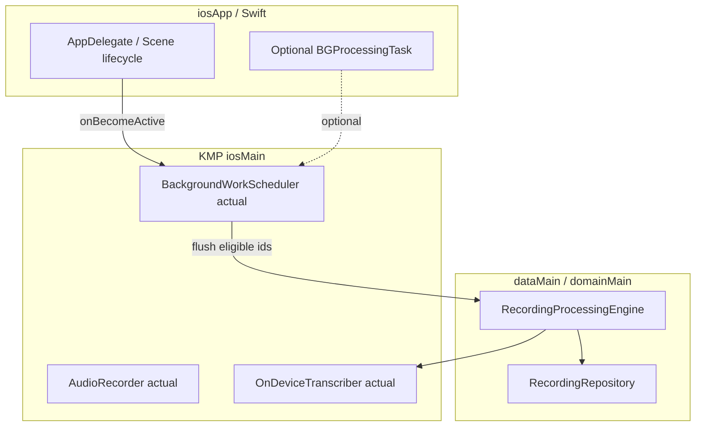

# Recording pipeline — iOS implementation plan

**Parent doc:** [`recording-pipeline-detailed-plan.md`](recording-pipeline-detailed-plan.md).

**Prerequisite:** Shared KMP work and **Android implementation** should be far enough along that **domain**, **data**, **SQLDelight**, **`RecordingProcessingEngine`**, and **`expect` APIs** are stable. This plan fills in **iOS `actual`s** and **Apple-specific** lifecycle, permissions, and background behavior.

**Goal:** Match Android product behavior: saved recording → on-device STT (en/hi) → English insight → background retry policy with **manual Retry** and **counter reset**.

---

## 0. Strategy: what the iOS track owns

| Item | Owner |
|------|--------|
| `OnDeviceTranscriber` **actual** (`iosMain`) | iOS plan |
| `BackgroundWorkScheduler` **actual** | iOS plan |
| `Info.plist` / privacy strings / speech entitlement | iOS plan |
| Optional **Swift** glue for `SFSpeechRecognizer` if not fully in Kotlin | iOS plan |
| **Reuse** engine, repository, SQLDelight (KMP), presentation Compose for iOS | Already shared |

**Minimum bar (v1):** Processing runs **reliably in foreground** after save and when user returns to app; **optional stretch** is true background parity with WorkManager.

---

## 1. iOS-specific architecture snapshot



---

## 2. Parity checklist (must match Android)

| Behavior | Verification |
|----------|--------------|
| No DB row → no processing | Same SQLDelight schema |
| `error_code` allowlist for “background retry” | Same `domain` rules |
| `background_wm_attempts` cap + **manual Retry resets** | Same repository API |
| English-only insight prompt | Shared `dataMain` service |
| Hindi unavailable → **block** + message | Map `SFSpeechRecognizer` failures to same `error_code` as Android |
| **10 min** max duration | Same validation in shared use case + iOS recorder |

---

## 3. iOS phases (ordered, small tasks)

### Phase ID — Permissions & project config

| ID | Task | Deliverable | Tests |
|----|------|-------------|-------|
| ID1 | `NSSpeechRecognitionUsageDescription`, `NSMicrophoneUsageDescription` in **Info.plist** | plist | Archive build; Settings shows strings |
| ID2 | If using **on-device** recognition: confirm deployment target and **Speech** framework capability | Xcode | Device test |
| ID3 | Link **Speech** framework to Kotlin framework target if required | Xcode project | Build `iosApp` |

### Phase IS — On-device transcription actual

| ID | Task | Deliverable | Tests |
|----|------|-------------|-------|
| IS1 | Implement `OnDeviceTranscriber` in `iosMain` using **`SFSpeechRecognizer`** + **`SFSpeechURLRecognitionRequest`** (file from recording path) | Kotlin/Native or Swift callback | Device: en + hi |
| IS2 | Prefer **`requiresOnDeviceRecognition = true`** when supported; if **not** available for **hi-IN**, return mapped **`ON_DEVICE_LANGUAGE_NOT_SUPPORTED`** (per product: block, no silent cloud) | Implementation | Device without Hindi pack |
| IS3 | Map `SFSpeechRecognizer` errors (locale, not authorized, no speech) → shared `error_code` | Table | Unit where possible; else device matrix |
| IS4 | Ensure audio file format matches what **SFSpeech** accepts (e.g. **caf**/wav); transcode in recorder if needed | `IosAudioRecorder` or pipeline | Manual playback + STT |
| IS5 | **10 min** duration enforced before save (shared + platform recorder) | Same as Android policy | Unit + manual |

### Phase IB — Background scheduler actual

| ID | Task | Deliverable | Tests |
|----|------|-------------|-------|
| IB1 | **Minimum:** `BackgroundWorkSchedulerIos` on **`scenePhase.active` / `UIApplication.didBecomeActiveNotification`** → query eligible recordings → `engine.scheduleImmediate` for each (or batch API) | `iosMain` + Swift hook if needed | Manual: background → foreground processes queue |
| IB2 | **Debounce** flush (e.g. coalesce within 1s) to avoid duplicate work with save-time `scheduleImmediate` | Scheduler impl | Manual |
| IB3 | **Stretch:** `BGProcessingTask` / `BGAppRefreshTask` to run **one** eligible id per task (mirror WM cap) | Swift + export to KN | Device: plugged-in, Wi‑Fi; Apple docs constraints |
| IB4 | Document **iOS does not guarantee** WM-like execution; UX copy if needed | `docs` or in-app | PM review |

### Phase II — DI & lifecycle wiring

| ID | Task | Deliverable | Tests |
|----|------|-------------|-------|
| II1 | Koin `iosMain`: provide real `OnDeviceTranscriber`, `BackgroundWorkScheduler` | Module | Launch app |
| II2 | Remove **stubs** that threw `NotImplementedError` once IS/IB done | `iosMain` | Compile all targets |
| II3 | Ensure **recording file paths** are valid when app resumes (sandbox persistence) | Path handling | Kill app → relaunch → process |

### Phase IJ — iOS QA matrix

| ID | Task | Deliverable |
|----|------|-------------|
| IJ1 | Devices: iPhone **physical** (Speech often limited on simulator for recognition) |
| IJ2 | **en** / **hi** with and without **on-device language** assets downloaded |
| IJ3 | Airplane mode: STT may still work on-device; insight fails → `FAILED` + Retry |
| IJ4 | Background: compare to Android WM — document gaps if only foreground flush |

---

## 4. Kotlin/Native vs Swift split (decision point)

| Approach | Pros | Cons |
|----------|------|------|
| **Pure `iosMain` Kotlin** with cinterop to Speech | Single language | cinterop setup for Speech can be heavy |
| **Swift implementation** + thin callback to Kotlin | Familiar iOS APIs | Two-language bridge maintenance |

Pick one in **IS1** and document in this file’s revision log.

---

## 5. Dependency order (iOS view)

```
Android handoff (stable expect APIs + engine) ──► ID* ──► IS* ──► IB* ──► II* ──► IJ*
```

**Do not** change `RecordingProcessingEngine` semantics on iOS-only branches unless Android is updated too.

---

## 6. Revision log

| Date | Note |
|------|------|
| 2026-04-03 | Initial iOS platform plan |
